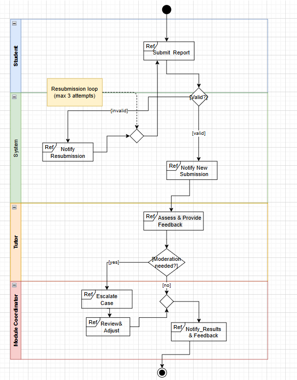
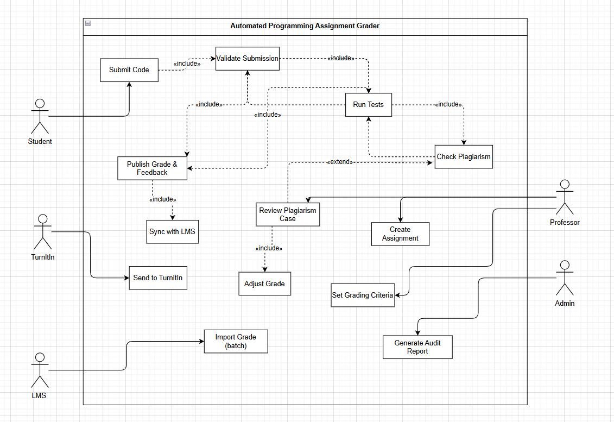
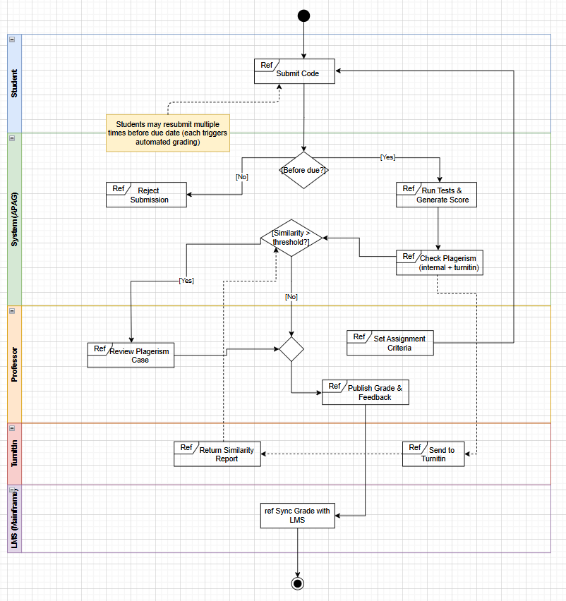

# Practical 2: USE CASE

## Interaction Overview (IoD) – How People Work Together

This diagram shows the big picture of how students, professors, and other systems work together to get assignments graded automatically.

The professor starts by setting up the assignment – due date, test cases, and grading rules.

The student uploads their code (they can try as many times as they want before the deadline).

The system checks if the submission is on time. If it's late, it's rejected.

If it's on time, the system runs the code and marks it automatically. It also checks for plagiarism (both by comparing with other students and sending to Turnitin).

If plagiarism is found, the professor looks at it and can change the grade if needed.

Finally, the grade is sent to the student and saved in the university’s main system (LMS).

Everything is saved so that auditors can check it later.

This flow saves professors from doing all the grading by hand and makes sure grading is fair and fast.

## Functional Use Case (UCD) – What the System Must Do

This diagram shows all the tasks the system needs to handle.

Student can submit code, see feedback, and resubmit before the deadline.

Professor can create assignments, set deadlines, define test cases, and also step in if plagiarism is suspected to change a grade.

Admin can make audit reports for the government.

Turnitin is an outside service that checks for copied code.

LMS is the university’s old system where final grades must be sent.

The arrows show how tasks are connected. For example, “Submit Code” always includes “Validate Deadline” and “Run Tests”. Checking plagiarism is part of the process, and if something looks copied, the professor gets involved.

## IoD based on UCD – How does the actors interact with each

This third diagram shows the step‑by‑step process with the system in the middle.

Professor → System: Sets up the assignment (deadline, tests, rubric).

Student → System: Submits code.

System checks: Is it before the deadline?

If no → Reject and tell the student.

If yes → Go ahead.

System runs tests in a safe container and gives a score.

System checks plagiarism by comparing with others and sending to Turnitin.

System decides: Is similarity too high?

If yes → Professor reviews and can adjust grade.

If no → Grade stays as is.

System publishes the final grade and feedback to the student.

System sends the grade to the LMS.

Auditor can look at all the logs later to check things.

The diagram uses swimlanes (Student, System, Professor, Turnitin, LMS) to show who does what. It also shows that students can resubmit many times – that’s why there’s a loop.

## What the System Needs to Do

From these diagrams, we can list what the system must have:

Students can upload code as many times as they want before the deadline.

The system checks the due date automatically.

The system runs test cases and gives a score.

The system checks for plagiarism – both inside the class and with Turnitin.

Professors can set up assignments, see plagiarism cases, and change grades.

All grades, test results, and plagiarism reports are stored forever so they can be checked.

Final grades are sent to the university’s old LMS (one‑way, because it’s hard to change).

Admin can make audit reports.

## How It’s Built

The system is built so that it’s cheap, safe, and works with the university’s existing computers.

Web page – students upload code, professors see results.

Submission checker – makes sure deadlines are followed.

Code runner – runs each student’s code in a separate box (like a container) so nothing bad can happen.

Plagiarism tool – compares code internally and talks to Turnitin.

Database – stores all results and logs.

LMS sync – sends grades to the mainframe system using a simple file upload.

All parts are separate so they can be updated or scaled easily.

## What Makes It Good

Fast – tests run automatically, so students get results quickly.

Safe – student code runs in isolation; it can’t harm the system.

Fair – automated checks mean every student gets the same treatment.

Auditable – everything is logged, so the government can inspect it.

Student‑friendly – multiple attempts and quick feedback reduce stress and help students learn.

### LINK for my AI used :
https://chatgpt.com/share/69cad237-75f0-8322-ab7f-fd654ad5390b
