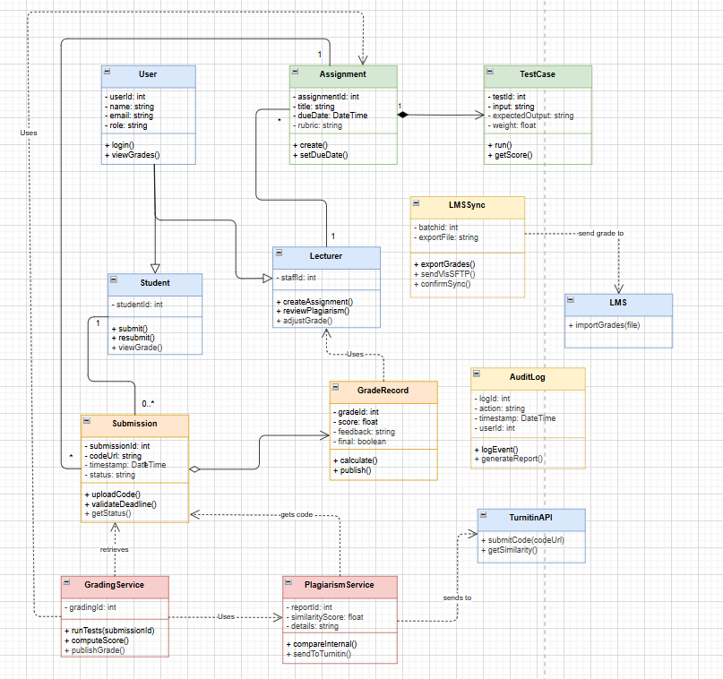

# Practical 3: Class Diagram and Object Diagram

## Class Diagram – Structure of the System

This diagram shows the strategy of the automated grading system, including all the classes, their properties (data), methods (actions), and how they work together.

User is the parent class. Student and Lecturer inherit from it . They share name, email, login.

A Lecturer creates a lot of Assignments. One assignment has a lot of test cases. Which is a strong connection because once the assignment is deleted, the test cases are deleted too.

A Student makes many Submissions. Each submission belongs to one student and one assignment.

Each Submission gets one GradeRecord (score, feedback). This is a weaker connection (aggregation: the grade can stand on its own for an audit).

The GradingService does the automatic grading. It uses the Submission, the Assignment, and the PlagiarismService, but only for a short time. It doesn't hold on to them forever.

The PlagiarismService compares code to other submissions and also reaches out to TurnitinAPI, which is an external service. It gets code from the submission.

LMSSync sends the final grades to the university’s old LMS (mainframe) using a batch file.

AuditLog keeps track of every important action. It is separate, but any class can write to it.

Why this matters: The class diagram shows developers exactly what data to store and how objects interact with each other. It speeds up coding and cuts down on mistakes.

## Object Diagram – A Snapshot of the System in Action

[alt text](object_diagram.png)
The class diagram is a general plan, but the object diagram shows a specific example at a certain point in time. We consider it as a picture of the system in action.

Tshering, a student, turned in her "Lab 1—Coding" assignment.

The assignment was created by Ms. Sonam. It has two test cases: one for a normal array [3,1,2] and one for an empty array [].

Tshering’s submission (code on GitHub) was graded by the GradingService. She scored 18 with feedback “Good work, but optimize loops.”

The PlagiarismService checked her code and found only 12% similarity, so there was no problem.

A log entry was saved: “Submission graded” at 14:35.

The LMSSync made a CSV file to send the grade to the LMS on the mainframe.

This diagram is helpful for testing and explaining a certain situation to people who aren't familiar with technological advances.

What These Diagrams Tell Us
The system is well-organised, and each part has a clear job to do. The class diagram shows us the plan, and the object diagram shows us how it works in real life.

The class diagram and object diagram together show the whole picture: the "what" (classes) and the "how" (objects working together).

### LINK for my AI used :

https://chatgpt.com/c/69d2776e-92b0-8324-89e9-da8582b1e39f
